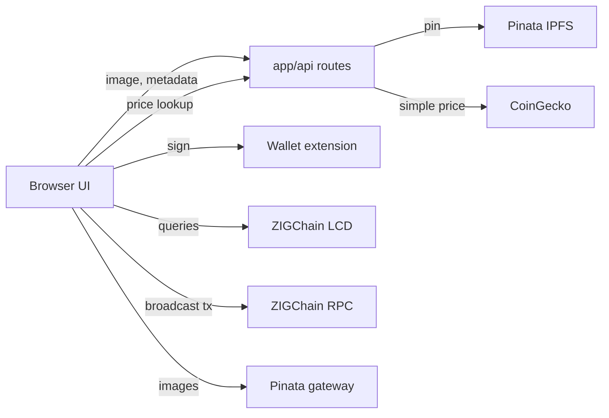

# Architecture

## Overview

This repository is a collection of self-contained ZIGChain example projects. It has no shared code, no root build and no workspace: each directory under `examples/<category>/<name>/` has its own manifest, lockfile, toolchain pin and README, and can be copied out on its own (the root [README.md](README.md) shows the sparse-checkout way to do that). The root holds only documentation and the license.

There are two examples today:

- **Token Factory** (`examples/frontend/token-factory/`): a Next.js 15 web app that lets a user connect a Cosmos wallet, create a Token Factory denom on ZIGChain with metadata and an IPFS image, mint its supply, and browse all factory tokens in a table.
- **IBC callbacks** (`examples/integrations/callbacks-module/`): a small CosmWasm counter contract plus a step-by-step tutorial. An ICS-20 transfer sent from Osmosis with a `dest_callback` memo makes ZIGChain's callbacks middleware call the contract, which increments a counter.

External systems, by role (the addresses live in each example's README and configuration, not here):

| Example | Talks to | For |
| --- | --- | --- |
| Token Factory | ZIGChain LCD (REST) and RPC nodes, one pair per network (mainnet, testnet) | Queries (tokens, balances, pools) and broadcasting signed transactions |
| Token Factory | Browser wallets through Cosmos Kit (Keplr only), and, when `NEXT_PUBLIC_WALLETCONNECT_PROJECT_ID` is set, the WalletConnect relay for Keplr Mobile | Account connection and transaction signing |
| Token Factory | Pinata (IPFS pinning API and a Pinata gateway) | Uploading token images and metadata JSON, and resolving `ipfs://` links |
| Token Factory | CoinGecko public API | USD prices for the tokens table, through a server-side proxy route |
| IBC callbacks | ZIGChain and Osmosis testnets, a Hermes relayer | Storing and instantiating the contract, sending the transfer and relaying the packet (all run by the reader from the CLI) |

## Codemap

Paths are relative to the repository root. Setup, run and check commands for each example are in [CONTRIBUTING.md](CONTRIBUTING.md).

### Repository root

- `README.md`: purpose, the examples table, the sparse-checkout recipe and links to the tutorials.
- `LICENSE`: MIT, for the repository as a whole (see [Licensing](#licensing)).
- `.gitignore`: ignores dependency and build output for any example (`node_modules/`, `.next/`, `out/`, `dist/`, `target/`) and local environment files.

### `examples/frontend/token-factory/`

Next.js 15 (App Router) and React 19 app written in TypeScript, styled with Tailwind CSS 3 and HeroUI 2.7 (the successor of NextUI; 2.7 is the last line that supports Tailwind CSS 3), with pnpm as the package manager (`pnpm-lock.yaml`, version pinned by `packageManager` in `package.json`). `pnpm.overrides` in `package.json` forces patched versions of vulnerable transitive dependencies. The Node.js version and the setup, run and build commands are in [CONTRIBUTING.md](CONTRIBUTING.md#quick-start); the example's [README](examples/frontend/token-factory/README.md#5-environment-configuration) describes every environment variable.

- `app/`: the App Router tree. `layout.tsx` wraps every page in `app/providers.tsx` (HeroUI, theme, network and wallet contexts); `page.tsx` renders the tokens table. `app/api/` holds three server-side route handlers: `files/route.ts` (POST, pins an uploaded image to Pinata), `metadata/route.ts` (POST, pins a metadata JSON to Pinata) and `coingecko/route.ts` (GET, proxies CoinGecko simple-price lookups with a 60-second revalidate).
- `components/`: client UI. `token-creation-form/` builds and sends the create-denom, set-metadata and mint messages; `token-table/` lists factory tokens; `wallet/`, `wallet-button/`, `add-chain-button/` and `network-switch/` handle wallet connection, adding the chain to the wallet and switching network; `navigation-bar/` and `mode-toggle/` are layout.
- `context/`: React providers. `ChainContext.tsx` (`WalletContextProvider`) sets up Cosmos Kit's `ChainProvider` with the Keplr extension from `cosmos-kit`, plus Keplr Mobile when a WalletConnect project ID is configured, and the selected network's endpoints, and creates the `ts-client` `chainClient`; `NetworkContext.tsx` holds the selected network; `ThemeProvider.tsx` wraps `next-themes`.
- `lib/`: `env.ts` reads the environment into `ENV_VARS` and `NETWORKS` and remembers the selected network in the browser's `localStorage`; `constants.ts` holds the native denom (`azig`, 18 decimals) and the pre-v5 `uzig` denom used as a display fallback; `chain-config.ts` builds the chain and asset descriptions Cosmos Kit and the wallets need; `hooks/` holds data hooks (`useTx` signs and broadcasts, `useTokenTableData`, `useBalances`, `usePools`, `usePoolId`, `useTokenMetadata`, `useTokenPrices`); `utils/` holds LCD fetchers, token display and price helpers and the address avatar.
- `ts-client/`: a generated TypeScript client for the Cosmos SDK, IBC, CosmWasm and ZIGChain (`zigchain.factory`, `zigchain.dex`) modules: protobuf types, registries and REST wrappers. It is generated code: ESLint ignores it (`.eslintrc.json`), and the repository has no script to regenerate it.
- `public/` and `assets/`: static files served by the app (logo, wallet logos) and README screenshots.
- Configuration files: `next.config.mjs`, `tailwind.config.ts`, `postcss.config.js`, `components.json` (shadcn/ui), `tsconfig.json`, `.eslintrc.json`, `.nvmrc`, `.env.example`.

### `examples/integrations/callbacks-module/`

A tutorial ([README](examples/integrations/callbacks-module/README.md)) plus one CosmWasm contract in `contract/`, a Rust crate named `counter` built on `cosmwasm-std` 2.2 (ZIGChain v5 runs a CosmWasm 2.x VM, per the comment in `Cargo.toml`). The toolchain pin and the local build and check commands are in [CONTRIBUTING.md](CONTRIBUTING.md#quick-start) and its [Testing](CONTRIBUTING.md#testing) section; the optimizer command is in the tutorial's section 2.

The optimized, deterministic build that goes on chain is made with the `cosmwasm/optimizer` Docker image and written to `contract/artifacts/`. Run the tutorial's `docker run` command from `callbacks-module/` (it mounts `./contract`), not from the repository root as the tutorial's wording suggests. Sections 3 to 7 of the tutorial store, instantiate and exercise the contract on public testnets with `zigchaind`, `osmosisd` and `hermes`.

- `contract/src/contract.rs`: the four entry points. `instantiate` sets the count to 0; `execute` handles `Reset {}`; `query` answers `Count {}` and `LastTransfer {}`; `ibc_destination_callback` receives `IbcDestinationCallbackMsg`, checks the ICS-20 acknowledgement, parses the packet data and the optional `counter.bump_by` value from the memo, and updates the state.
- `contract/src/msg.rs`: `InstantiateMsg`, `ExecuteMsg`, `QueryMsg` and the response types.
- `contract/src/state.rs`: the two storage items, `COUNT` (`u64`) and `LAST_TRANSFER` (`LastTransfer`: sender, receiver, funds).
- `contract/src/error.rs`: `ContractError` (`Std`, `NotATransfer`, `EmptyFunds`).
- `contract/artifacts/`: the committed optimizer output, `counter.wasm` and `checksums.txt`.
- `contract/Cargo.toml`, `Cargo.lock`, `rust-toolchain.toml`, `.cargo/config.toml`: crate manifest (release profile tuned for wasm size), lockfile, toolchain pin and build aliases.
- `LICENSE`: the example's copy of the root MIT license.

## Data and Control Flow

**Token creation (Token Factory).** The user fills in the form in `components/token-creation-form/`. The browser posts the image to `/api/files` and the metadata JSON to `/api/metadata`; those server routes pin them to Pinata with the server-only Pinata key and return the IPFS hashes. The form then builds three ZIGChain factory messages (`MsgCreateDenom`, `MsgSetDenomMetadata`, `MsgMintAndSendTokens`, with types from `ts-client/zigchain.factory`), and `useTx` has the connected wallet sign them as one transaction and broadcasts it through the selected network's node.

**Token listing (Token Factory).** `useTokenTableData` and the other hooks query the selected network's LCD node for factory denoms, balances and pools (`lib/utils/fetchers.ts`), resolve metadata and images through the Pinata gateway, and get USD prices from `/api/coingecko`, which calls CoinGecko server-side.

**IBC destination callback (callbacks module).** A user on Osmosis sends an ICS-20 transfer to ZIGChain with a memo holding `dest_callback` (the contract address and a gas limit) and, optionally, a `counter` object. A relayer delivers the packet; ZIGChain's transfer stack credits the tokens and its callbacks middleware calls the contract's `ibc_destination_callback` export. The contract increments `COUNT` by `bump_by` (1 when absent or malformed) and records the transfer in `LAST_TRANSFER`. The tutorial's diagram shows the same path.

## Cross-Cutting Concerns

### Configuration and Secrets

Token Factory reads its settings from environment variables, loaded by Next.js from `.env.local` (listed in `.env.example`, described in the example's README). Variables prefixed `NEXT_PUBLIC_` are compiled into the browser bundle: network endpoints and chain IDs, the default network, the Pinata gateway address, the optional WalletConnect project ID and the site title and description. `lib/env.ts` falls back to built-in public network defaults when a variable is unset; its fallback default network is mainnet. The Pinata API key is the only secret and is read only by the two server routes, never by client code. Wallet keys never touch the app: signing happens in the wallet extension. `.env` and `.env.local` files are git-ignored at the root and in the example.

The callbacks tutorial keeps its settings in shell variables that the reader exports (section 1 of the tutorial). Keys live in the `zigchaind`, `osmosisd` and Hermes keyrings on the reader's machine; the tutorial imports relayer mnemonics from a temporary file and shreds it afterwards.

### Errors and Logging

Token Factory reports failures to the user with `sonner` toasts and writes details to the browser console with `console.error`. The Pinata routes return a generic `500` with `{"error": "Internal Server Error"}` when the call throws or Pinata rejects the request. The CoinGecko route returns `400` for a missing query and `502` only if the upstream request throws; a non-OK CoinGecko response is skipped, so the route can answer `200` with an empty object. None of them logs. After a successful transaction the creation form also posts a record to `/api/log-coins` (`components/token-creation-form/index.tsx`). No such route exists, so the request returns 404 and nothing reports it. `ENABLE_LOGGING` is read into `env.enableLogging` in `lib/env.ts`, but no code uses it today. The app does not import `pino-pretty`; WalletConnect's logger loads it optionally, which is why it is a dependency.

The contract returns `ContractError` from `ibc_destination_callback` when the acknowledgement is an error or the packet is not a valid ICS-20 transfer (`NotATransfer`) or carries a zero amount (`EmptyFunds`). It reports what happened through response attributes (`action`, `count`, `bump_by`, sender, receiver, amount), which show up in the transaction events.

### Licensing

Everything in the repository is MIT. The root `LICENSE` covers the repository as a whole, and each example carries its own copy (`examples/frontend/token-factory/LICENSE`, `examples/integrations/callbacks-module/LICENSE`) so it stays licensed when copied out. The callbacks contract's `Cargo.toml` declares `license = "MIT"` to match.

## Architectural Invariants

- Each example is self-contained: it has its own manifest, lockfile, toolchain pin and README, and never imports from another example or from the root. Adding an example means adding a directory under `examples/<category>/` and a row in the root README's examples table.
- In Token Factory, secrets are read only by server code in `app/api/`. Anything with a `NEXT_PUBLIC_` prefix is public by design and must never hold a secret.
- Token Factory never holds private keys. Every transaction is signed by the connected wallet.
- `ts-client/` is generated code: do not edit it by hand, and keep it out of lint.
- The callbacks contract targets CosmWasm 2.x (`cosmwasm-std` 2.2 with the `cosmwasm_2_2` feature). The destination callback must stay a top-level `#[entry_point] fn ibc_destination_callback`, because the middleware looks the export up by that name.
- The contract only changes state after a successful ICS-20 acknowledgement with a non-zero amount.
- The examples are demonstrations, not production code: the contract's `Reset {}` has no access control, and the Token Factory API routes have no authentication or rate limiting of their own. The disclaimer at the top of each README says to review settings and logic before any production use.
- Changing the contract source means rebuilding with the optimizer and committing the new `contract/artifacts/counter.wasm` and `checksums.txt` together, so the artifact always matches the source.

## Runtime and Deploy Shape

Nothing in this repository is deployed by its CI. The examples run on the reader's machine: Token Factory as a local Next.js server (commands in [CONTRIBUTING.md](CONTRIBUTING.md#quick-start)), which its README says can also be deployed to a Next.js host such as Vercel with the same environment variables; the callbacks contract as a wasm file the reader stores on a public testnet by hand.
