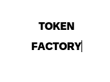
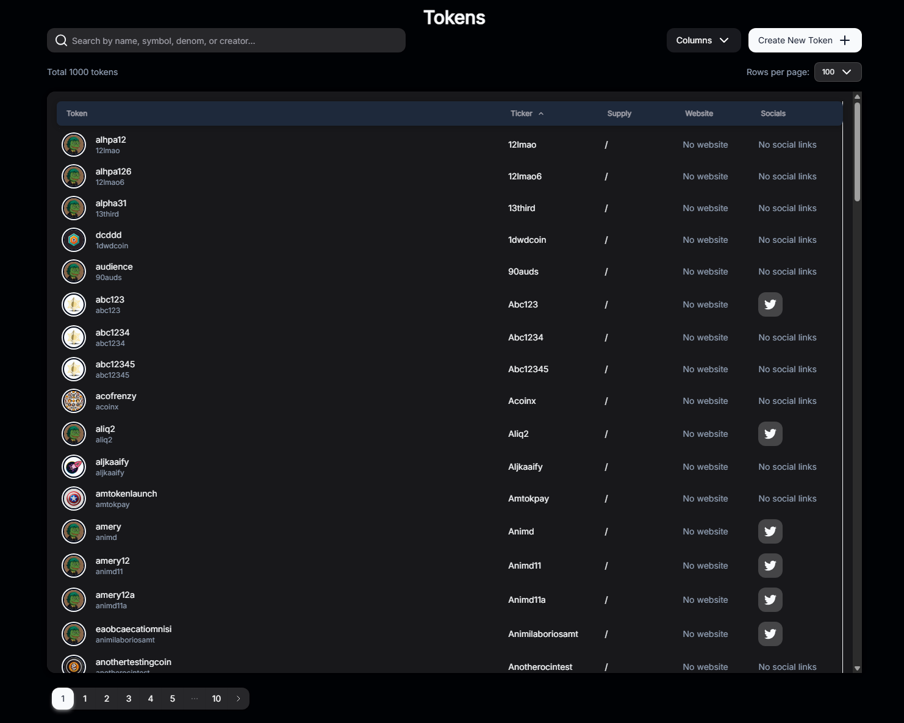
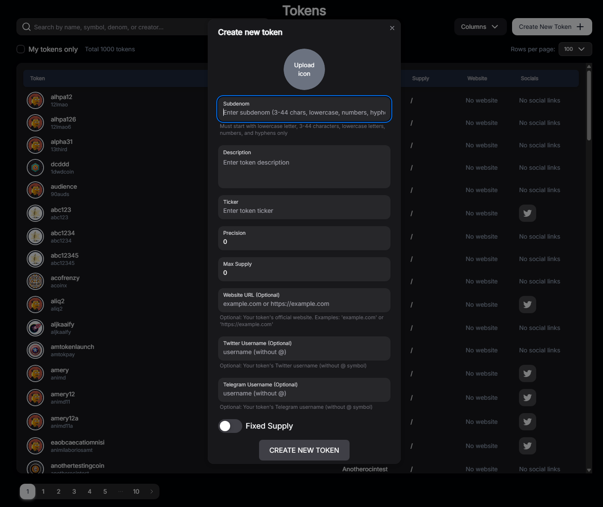

# ZIGChain Token Factory

**Category:** Frontend

---

## 2. What This Example Demonstrates

This example provides a **complete token factory interface**—a web app where users can create and list tokens on ZIGChain, all from one UI.

- **Full token factory UI:** Create new tokens (denoms), set metadata and images, mint supply, and view all tokens in a sortable table—powered by ZIGChain’s Token Factory module.
- Connect a wallet (Cosmos Kit) and broadcast create-denom / mint messages.
- Upload token metadata and images to IPFS (Pinata) and display tokens in the table.
- **ZIGChain concept:** Token Factory (native denom creation, metadata).
- **Target level:** Beginner / Intermediate.

---

## 3. Prerequisites

- **Node.js** 18+ (see [Toolchain](#toolchain-pinning) for pinned version).
- **npm** (or yarn / pnpm / bun).
- **Wallet** — a Cosmos-compatible wallet (e.g. Keplr, Leap) for signing transactions.
- **ZIGChain testnet account** — recommended for testing (no mainnet funds required).
- **Pinata account** — for IPFS (token images); see [Environment Configuration](#5-environment-configuration).

---

## 4. Quick Start

```bash
git clone --depth 1 --filter=blob:none --sparse https://github.com/ZIGChain/zigchain-examples.git zigchain-examples
cd zigchain-examples
git sparse-checkout set examples/frontend/token-factory
cd examples/frontend/token-factory
npm i
cp .env.example .env.local
npm run dev
```

Then open [http://localhost:3000](http://localhost:3000). Set `PINATA_JWT` and `NEXT_PUBLIC_GATEWAY_URL` in `.env.local` for token image uploads (see [Environment Configuration](#5-environment-configuration)).

---

## 5. Environment Configuration

Copy `.env.example` to `.env.local` and fill in the values you need. Each variable is described below.

### Mainnet and testnet (provided as default)

These values are already set in `.env.example` for ZIGChain mainnet and testnet. You can leave them as-is unless you use a custom or local node.

- **`NEXT_PUBLIC_MAINNET_API_URL`** — LCD API URL for mainnet (default: `https://public-zigchain-lcd.numia.xyz`).
- **`NEXT_PUBLIC_MAINNET_RPC_URL`** — RPC URL for mainnet (default: `https://public-zigchain-rpc.numia.xyz`).
- **`NEXT_PUBLIC_MAINNET_CHAIN_ID`** — Mainnet chain ID (default: `zigchain-1`).
- **`NEXT_PUBLIC_TESTNET_API_URL`** — LCD API URL for testnet (default: `https://public-zigchain-testnet-lcd.numia.xyz`).
- **`NEXT_PUBLIC_TESTNET_RPC_URL`** — RPC URL for testnet (default: `https://public-zigchain-testnet-rpc.numia.xyz`).
- **`NEXT_PUBLIC_TESTNET_CHAIN_ID`** — Testnet chain ID (default: `zig-test-2`).

### Default network

- **`NEXT_PUBLIC_DEFAULT_NETWORK`** — Which network the app uses by default: `mainnet` or `testnet`. The app then uses the corresponding API URL, RPC URL, and chain ID from the variables above. Set to `testnet` for safe testing.

### Token images (required for uploads)

- **`PINATA_JWT`** — Your JWT for the [Pinata](https://www.pinata.cloud) IPFS API. Create an API key in the Pinata dashboard and paste the JWT here. Required for uploading token images.
- **`NEXT_PUBLIC_GATEWAY_URL`** — Your Pinata gateway URL (e.g. `https://your-subdomain.mypinata.cloud`). Found under **Gateways** in the Pinata dashboard. Used to resolve IPFS URLs for token images.

No private keys go in env; wallet signing is done via the connected wallet.

### Site branding

- **`NEXT_PUBLIC_SITE_TITLE`** — Name shown in the browser tab, nav bar, and logo alt text. Optional; default in `.env.example` is `My Token Factory`.
- **`NEXT_PUBLIC_SITE_DESCRIPTION`** — Meta description for the app (e.g. for search results and social previews). Optional; default in `.env.example` is `Token Factory for My Project`.

### Logging

- **`ENABLE_LOGGING`** — Set to `true` to enable app logging; set to `false` (default) to disable.

---

## 6. Project Structure

- `app/` — Next.js App Router pages, layout, API routes (e.g. CoinGecko proxy).
- `components/` — UI (wallet, token creation form, tokens table).
- `lib/` — env parsing, hooks (e.g. `useTx`), token display/pricing helpers.
- `ts-client/` — Generated Cosmos/ZIGChain client (LCD, Tx, Token Factory, etc.).
- `public/` — Static assets (logo, favicon).

---

## 7. How It Works

- The app uses **Cosmos Kit** for wallet connection and **CosmJS** (Stargate/LCD) under the hood. Generated **ts-client** code talks to ZIGChain LCD for queries and builds messages for the **Token Factory** module (create denom, set metadata, mint).
- **Transactions** are built and broadcast via the connected wallet; create-denom and mint messages are sent to the chain using the configured RPC/API URLs.
- **Token list** is read from chain (Token Factory + bank module); metadata and images are resolved from IPFS via the Pinata gateway when available.

---

## 8. Running on Different Networks

The app includes a **network switch in the frontend** so users can change networks (mainnet / testnet) without editing the environment. The switch reads the API URL, RPC URL, and chain ID for each network from your `.env` file — the same variables described in [Environment Configuration](#5-environment-configuration).

- **Testnet (default):** The app starts on testnet using `NEXT_PUBLIC_TESTNET_*` and chain ID `zig-test-2`. Good for trying token creation without mainnet funds.
- **Mainnet:** Use the in-app network switch to switch to mainnet; it uses `NEXT_PUBLIC_MAINNET_*` and `zigchain-1`. You can also set `NEXT_PUBLIC_DEFAULT_NETWORK=mainnet` in `.env` if you want mainnet as the initial network.
- **Local node:** To use your own node, set the corresponding `NEXT_PUBLIC_MAINNET_*` or `NEXT_PUBLIC_TESTNET_*` API URL, RPC URL, and chain ID in `.env` to point to your local LCD/RPC. The same frontend switch then toggles between whatever networks you configured.

---

## 9. Build / Production

```bash
npm run build
npm run start
```

Deploy the output (e.g. Vercel): connect the repo, set the same env vars in the dashboard, and deploy. Use `NEXT_PUBLIC_*` for any client-visible URLs and chain IDs.

---

## 10. Related Resources

- [ZIGChain Examples](https://github.com/ZIGChain/zigchain-examples) — this repo.
- ZIGChain docs — Token Factory and chain endpoints (add your docs link when available).
- [Pinata Quickstart](https://docs.pinata.cloud/quickstart) — IPFS and gateway setup.

---

## Screenshots

### Tokens Table



### Create New Token



---

## Toolchain Pinning

This project uses **Node.js 20**. If you use [nvm](https://github.com/nvm-sh/nvm), run `nvm use` in the project root (see `.nvmrc`).
